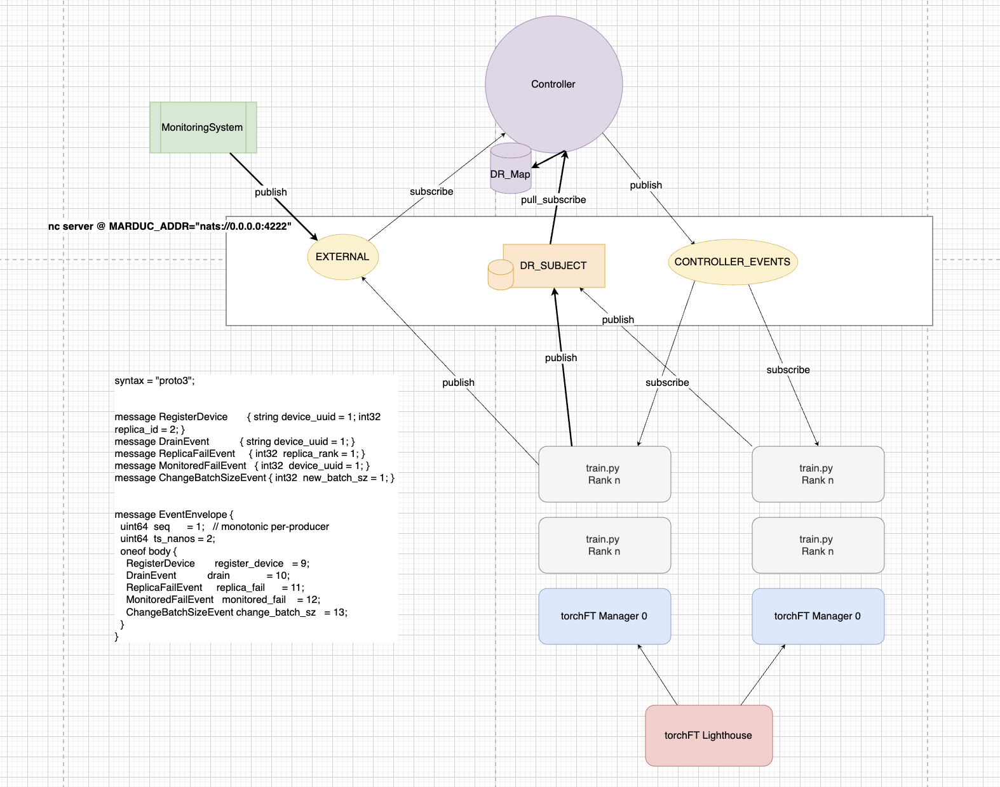

# Design

# Marduk

Marduk is the mesopatamian god.

An AI datacenter should also have an all-encompassing controller, like Marduk that controls the world.

Currently, there are many orchestration frameworks. However, none of the frameworks provide run-time monitoring and control of the training process. 

The need for this comes from two parts:

1. Running AI model training is different from traditional scientific computing is that we do not have a deterministic computation that we want to run, but a model that we want to train. It is not gardening. It should be as interactive as possible. If the training is unstable, is it possible to not restart, but to change the config directly?

## Code Design

DRMap is a crucial part of the design. It is the way for the controller to translate from the langauge of the monitoring system (device_uuid) to the language of the training manager (replica_id).

Upon manager initialization, it will register itself with the controller.

DRMap is designed to be as general as possible. It is a many to many mapping. Each device_uuid can map to many replica_ids and each replica_id can map to many device_uuids.