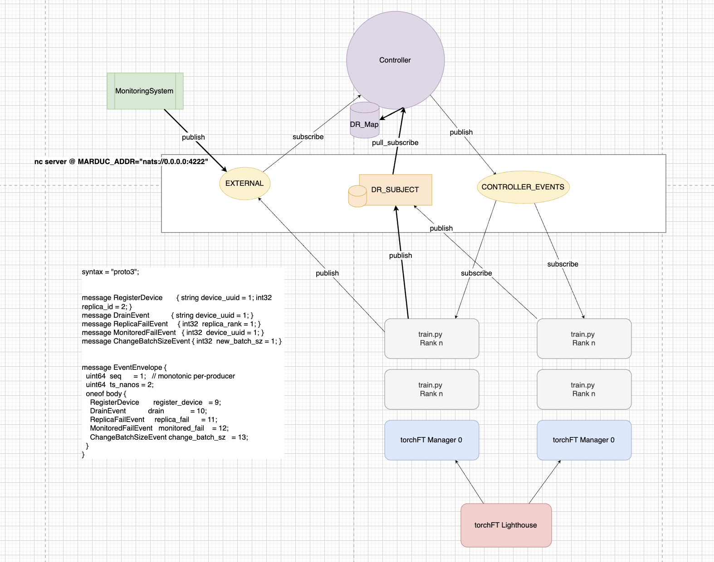

# Marduk Design



## Motivation

AI model training differs fundamentally from traditional scientific computing. Rather than running deterministic computations, we train models through an interactive, iterative process. This requires:

1. **Real-time monitoring** to detect failures and performance issues
2. **Dynamic control** to adjust parameters without restarting training
3. **Resource mapping** to translate between hardware and training units

Current orchestration frameworks focus primarily on deployment and scheduling but lack runtime monitoring and control capabilities needed for efficient AI training operations.

## Architecture

Marduk serves as a central controller for the entire training environment, connecting monitoring systems with training processes through a lightweight messaging system.

### Key Components

1. **Controller**: Central service that maintains the device-to-replica mapping and coordinates responses to failures
2. **Manager Integration**: Direct integration with TorchFT Manager in each training process
3. **NATS Messaging**: Pub/sub communication layer for system events
4. **Monitor CLI**: Command-line interface for manual control and testing

## Implementation Details

### Environment Configuration

Marduk can be configured through environment variables:

```python
os.environ["MARDUK_ADDR"]  # Default: nats://localhost:4222
```

All constants are defined in `torchft/marduk/constants.py`.

### Device-Replica Mapping (DRMap)

The DRMap is the core data structure that enables Marduk to translate between monitoring system events (device_uuid) and training system events (replica_id).

The mapping is implemented as two related maps:

1. `device_to_replicas`: Maps hardware device IDs to training replica IDs
2. `replica_to_devices`: Maps training replica IDs to hardware device IDs

This is designed as a flexible many-to-many mapping:
- Each device can be associated with multiple replicas
- Each replica can span multiple devices

#### Invariant

If a device_uuid is mapped to a set of replica_ids, then each of those replica_ids must also map back to that device_uuid in the replica_to_devices map (though a replica may also map to additional devices).

### Registration Process

Upon initialization, each Manager instance registers itself with the controller, providing:
1. Its replica_id
2. The device_uuid(s) it's running on

This builds the DRMap dynamically as training processes start up.

### Failure Detection and Response

When a device failure is detected:
1. The monitoring system reports the device_uuid to the controller
2. The controller looks up affected replicas in the DRMap
3. The controller sends failure notifications to all affected replicas
4. Each replica triggers its recovery process through TorchFT